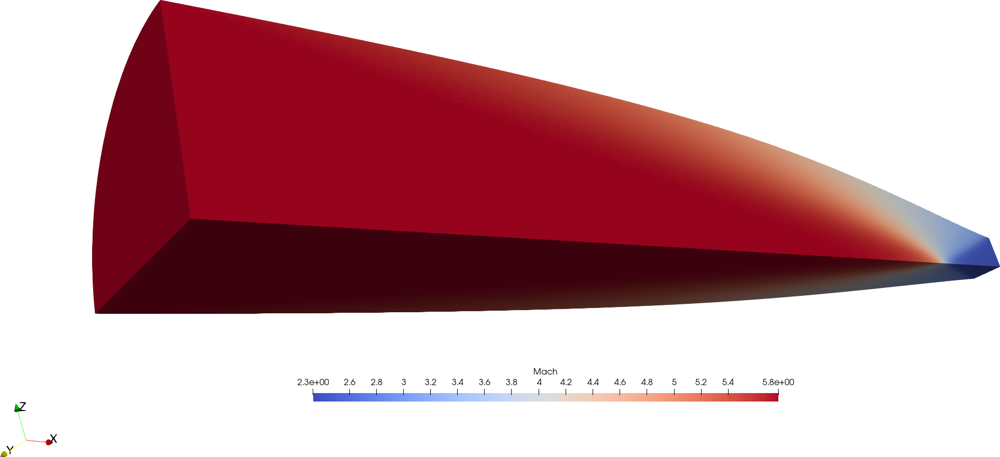

= PINGVIN: A 3D space-marching solver for simulating supersonic gas dynamics

Rowan J. Gollan
2024-09-09

== Prerequisite software

Presently, Pingvin is designed to be quite minimal on dependencies.
The core solver is written in the Odin programming language and some
of the support tools rely on Python packages.

You will need:

* An Odin compiler
* Python pyvista package
* Python gmsh package (or another way to generate a 2D quad mesh)
* Python scipy package
* Python click package

=== Odin compiler

Please follow the instructions at:

https://odin-lang.org/docs/install/

=== Python environment

It's convenient to set up a Python virtual environment.
We'll explain that in the installation instructions.

== Setting up and installing Pingvin

1. Download the source code from github:

   > git clone https://github.com/rjgollan-on-github/pingvin.git pingvin

2. Build the source

   > cd pingvin
   > make install

3. Set your environment variables in a `.bashrc` (or equivalent file for your platform)

    export PINGVIN=$HOME/pingvin
    export PATH=$PINGVIN/inst:$PATH

4. Set up a Python virtual environment and install required packages

   > python(3) -m venv py-env
   > source py-env/bin/activate
   > pip install pyvista
   > pip install gmsh
   > pip install scipy
   > pip install click

Use `python3` if your system doesn't provide a `python` command that points to a Python 3 installation.
You might need to re-login or source the `.bashrc` file to get your environment properly set.

==  Trying things out

Navigate to the Busemann diffuser example in pingvin/examples/diffuser-busemann, and follow the README.
Hopefully, you get an image something like the one at the top of this README.

